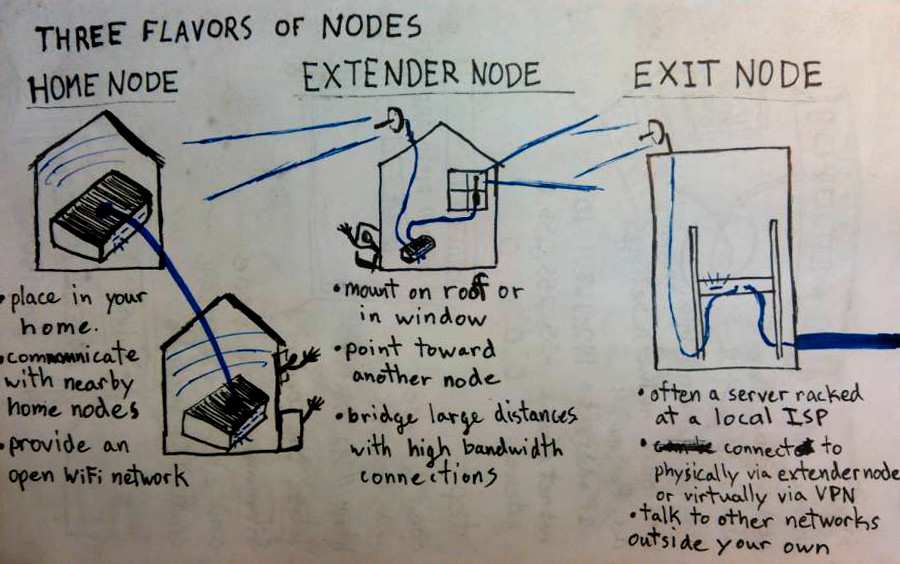
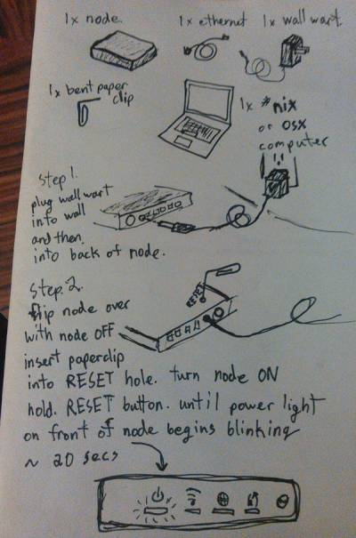

<h1>
    <a href="index">Build Your Own Internet (BYOI)
    </a> 
</h1>

# Flash Your Node

In general, there are three types of nodes that you may encounter; home nodes, extender nodes, and exit nodes:

Flashing, typically, refers to the process of replacing the default firmware of a device with a new, customized firmware. Both home nodes and extender nodes can be flashed. Exit nodes are, usually, full Linux computers and, therefore, require different techniques.  

To see an example of how to flash a home node, check out the [SudoMesh walkthrough](https://sudoroom.org/wiki/Mesh/WalkThrough) or follow these instructions,  

:----------------------------------:|:-----------------------------------:
 |  

  

The person who associated CC0 with the above images has waived all copyright and related or neighboring rights to this work.   

