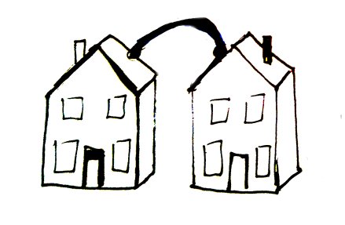
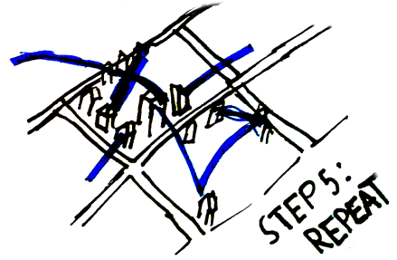

## ... or join an [existing one](networks).
### Learn > Build > Use > Share > Repeat

<ul class="steps columns-2">
    <li class="getnode">
        

        

            <h4>Step 1: Get a node</h4>
            for yourself and get it to blink.
        

    </li>
    <li class="givenode">
        

        

            <h4>Step 2: Give a node</h4>
            to a neighbor, friend, or family member.
        

    </li>
    <li class="meshnode">
        

        

            <h4>Step 3: Connect nodes</h4>
            between homes, apartments, community centers, etc.
        

    </li>
    <li class="buildinternet">
        

        

            <h4>Step 4: Build a network</h4>
            in your neighborhood, talk to nearby communities to build an INTER-NETwork.
        

    </li>
</ul>

### 

### Please help [improve this website](https://github.com/buildyourowninternet/buildyourowninternet.github.io)
