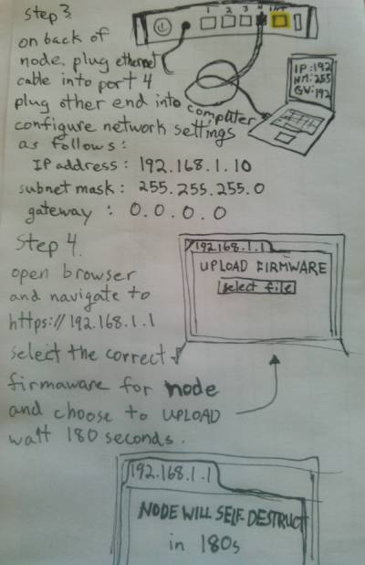

<h1>
     
    Build Your Own Internet (BYOI)
</h1>
### Workstations: [Crimp Your Cable](https://github.com/sudomesh/propaganda/blob/master/how-to-make-straight-through-network-cables.pdf) | [Flash Your Node](https://sudoroom.org/wiki/Mesh/WalkThrough) | [Dig Your Tunnel](https://github.com/sudomesh/tunneldigger-lab) | [Maintain Your Node](https://github.com/sudomesh/babeld-lab/blob/master/operator_manual.md) | [Setup Your Service](https://github.com/sudomesh/babeld-lab/blob/master/services_guide.md) | [Say Hi](https://www.eventbrite.com/e/build-your-own-internet-v4-tickets-39566902671)  

Learn > Build > Use > Share > Repeat

Build Your Own Internet by joining [existing networks](networks), learning the skills needed to run your own mesh network, and teach what you've learned by holding your very own BYOI Workshop. Also, please help [improve this website](https://github.com/buildyourowninternet/buildyourowninternet.github.io/). 

Alternatively, follow these instructions:  

:-------------------------:|:-----------------------------:
 |  

  

The person who associated CC0 with the above images has waived all copyright and related or neighboring rights to this work.   
This website is based on Sudo Mesh's "Build Your Own Internet" series of workshops.  
Licenses for linked content may vary.  
