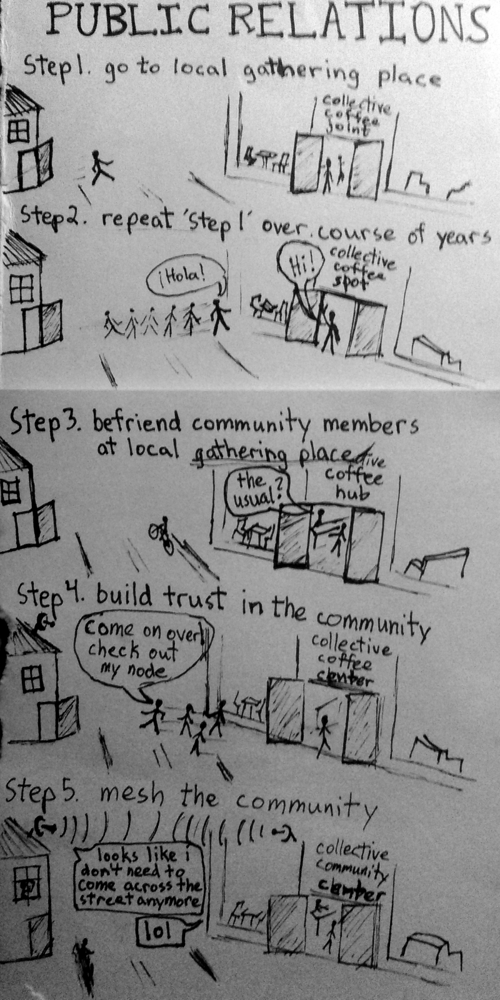

## Say Hi!

Community networks are nothing without the people who build, maintain, and use them. To have a communications network, you first must have a community worthy and in want of connecting. As nice as it would be for networks to appear out of thin air, they don't. As much as some Internet Service Providers(ISPs) would like to convince communities that the Internet flows from the ether, it doesn't. And as much as platform monopolies (that app you love or that search engine you use) would love to keep you ignorant of what is really in the cloud, they can't.

Building a network first requires making human connections. Here's an easy-to-follow guide to get you started.  

  

 
